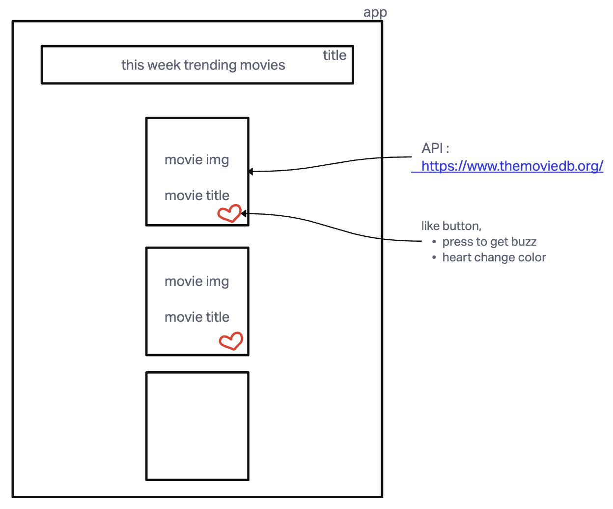

# LAB - Class 41, 42

## Project: Mobile App - tranding Movies

### Author: Brenda Jow

### Problem Domain  

This app shows this week's trending movies.

### Setup

#### `.env` requirements

env for React API key, but seems like the env file does not work well wtih React-Native

#### How to initialize/run your application (where applicable)

`npx expo start`

#### How to use your library (where applicable)

#### Features / Routes

- phone buzzed when liked-button pressed

#### UML

